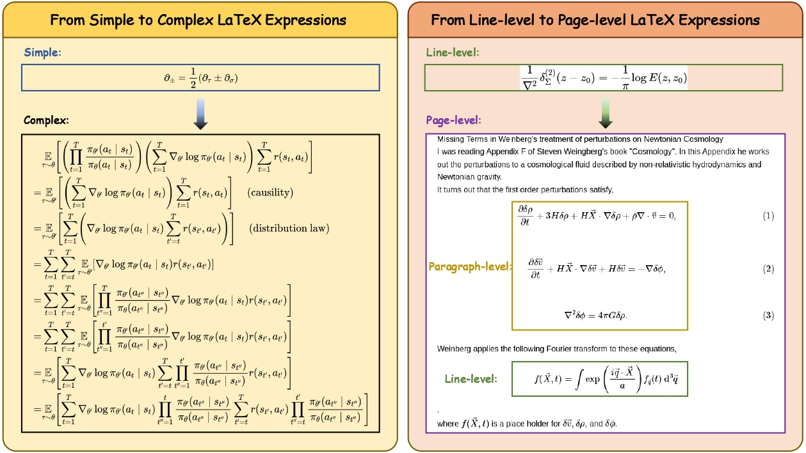
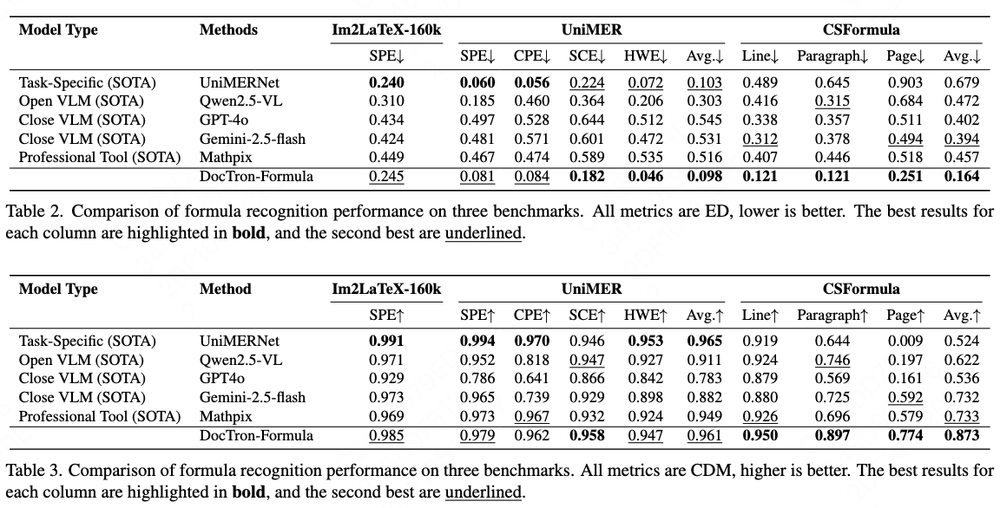

<div align="center">
  <h1>DocTron-Formula: Generalized Formula Recognition in Complex and
Structured Scenarios</h1>
</div>

<div align="center">
<!-- <a href='https://arxiv.org/abs/2507.15509'>
  
</a>
&ensp;-->
<a href='https://huggingface.co/DocTron/DocTron-Formula'>
  
</a>
&ensp;
<a href='https://huggingface.co/spaces/DocTron/DocTron-Formula'>
  
</a>
&ensp;
<a href='https://github.com/tatsu-lab/stanford_alpaca/blob/main/LICENSE'>
  
</a>
</div>


<div align="center">
Yufeng Zhong, Zhixiong Zeng†, Lei Chen, Longrong Yang, Liming Zheng, Jing Huang, Siqi Yang, Lin Ma*
</div>
<div align="center">
<strong>Meituan Group</strong>
</div>
<div align="center">
† Project Leader; * Corresponding Author
</div>

---
Optical Character Recognition (OCR) for mathematical formula is essential for the intelligent analysis of scientific literature. However, both task-specific and general vision-language models often struggle to handle the structural diversity, complexity, and real-world variability inherent in mathematical content. In this work, we present **DocTron-Formula**, a unified framework built upon general vision-language models, thereby eliminating the need for specialized architectures. Furthermore, we introduce **CSFormula**, a large-scale and challenging dataset that encompasses multidisciplinary and structurally complex formulas at the line, paragraph, and page levels. Through straightforward supervised fine-tuning, our approach achieves state-of-the-art performance across a variety of styles, scientific domains, and complex layouts. Experimental results demonstrate that our method not only surpasses specialized models in terms of accuracy and robustness, but also establishes a new paradigm for the automated understanding of complex scientific documents.
<div align="center">

</div>

## 📢 News and Updates
* ```2025.08.01``` We have released our model weights ([DocTron-Formula](https://huggingface.co/DocTron/DocTron-Formula)) and an interactive [Demo](https://huggingface.co/spaces/DocTron/DocTron-Formula) on Hugging Face.

## 🤗 Models
|  Model   | Download Link  |
|  ----  | ----  |
|  DocTron-Formula |  [DocTron/DocTron-Formula](https://huggingface.co/DocTron/DocTron-Formula)  |

The ```DocTron-Formula``` is Qwen2.5-VL-7B-Instruct fine-tuned with supervised learning on the Im2LaTeX-160k, UniMER and CSFormula dataset. 

## 📊 Performance

<div align="center">

</div>
